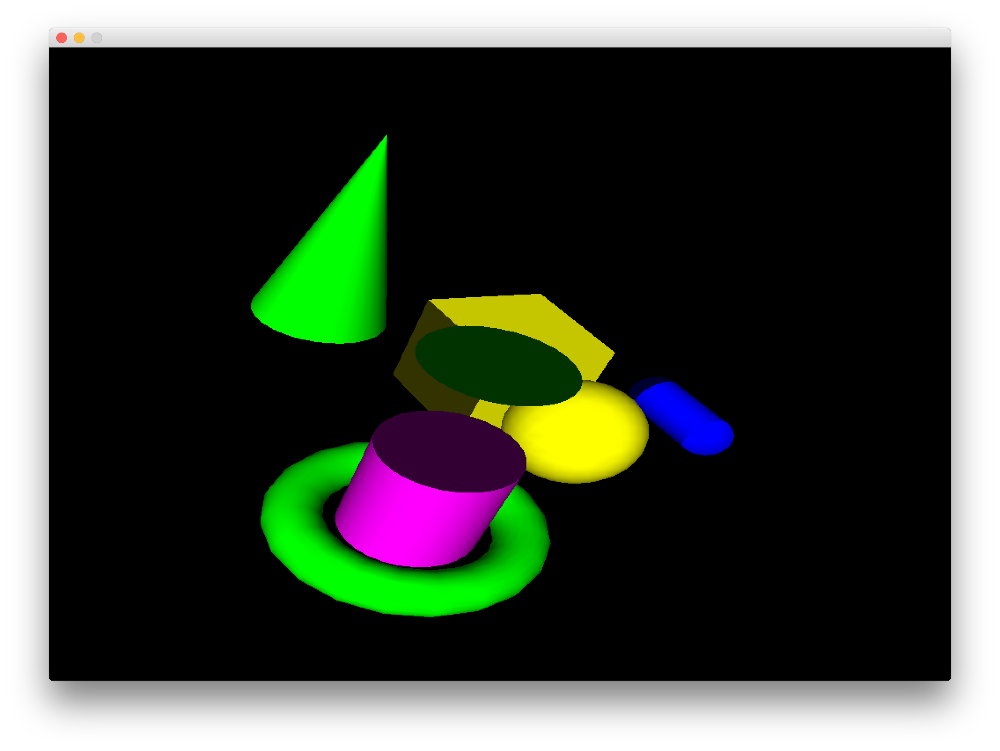

#GLFunctions
This is the boilerplate code for the lab session in generating classes.

You will need to wire Mat4 and Vec4 classes bases on the class diagram below 

Note that the code will not initiall compile so you will have to create the source and header files first.

The final output of the program should look like this

